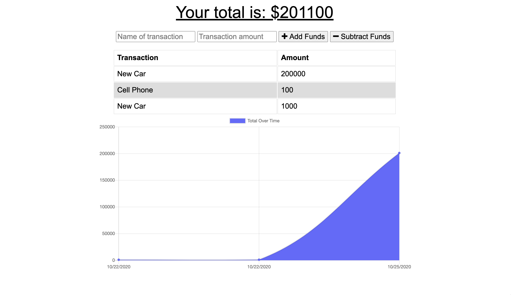
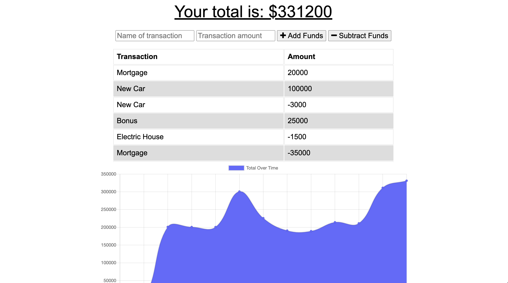
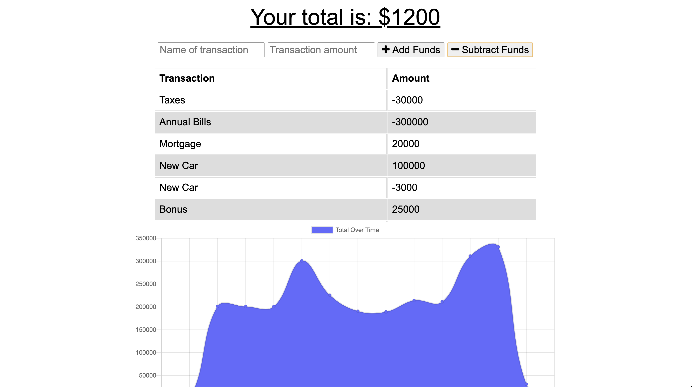

# BUDGET TRACKER

## Description
Budget Tracker is Progressive Web Application (PWA) providing the user with online and offline functionality. The user will be able to add expenses and deposits to their budget with or without a interent connection. When users enter transactions offline, they will be able to populate the budget total when brought back online. 

Core Functionality:
  * Enter deposits offline
  * Enter expenses offline
  * Offline entries will be added to the tracker
  * Automatic entry updating once brought back online

## Main Photo

## Screen Shots

| | |
|:-------------------------:|:-------------------------:|
| photo 1|  photo 2|
| photo 3| photo 4|

## Technology
* [MongoBD](https://www.mongodb.com/)
* [Mongoose](https://mongoosejs.com/docs/)
* [Express](https://www.npmjs.com/package/express)
* [Express-Compression](https://www.npmjs.com/package/compression)
* [Heroku](https://devcenter.heroku.com/categories/reference)
* [Node.js](https://nodejs.org/en/)
* [npmjs](https://docs.npmjs.com/)
* [HTML](https://developer.mozilla.org/en-US/docs/Web/HTML)
* [CSS](https://developer.mozilla.org/en-US/docs/Web/CSS)
* [Boostrap](https://getbootstrap.com/)

## Testing
* [Lighthouse](https://drive.google.com/file/d/1B2gTNZKCgx4YmC1L8VOV1KtV6m9a-T29/view?usp=sharing)
  

## Authors
**Payton Banks**
- [LinkedIn](https://www.linkedin.com/feed/)
- [Github](https://github.com/paytonbanks)
- [Email](mailto:payton.banks@gmail.com)
